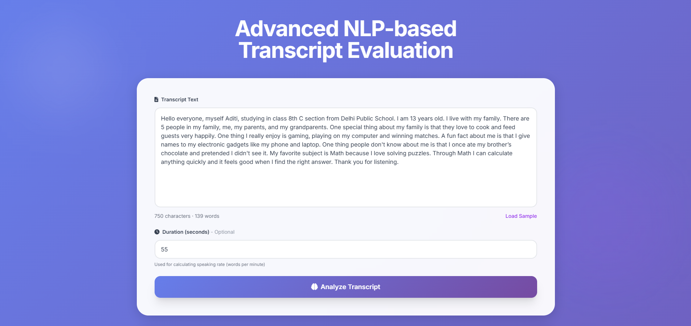
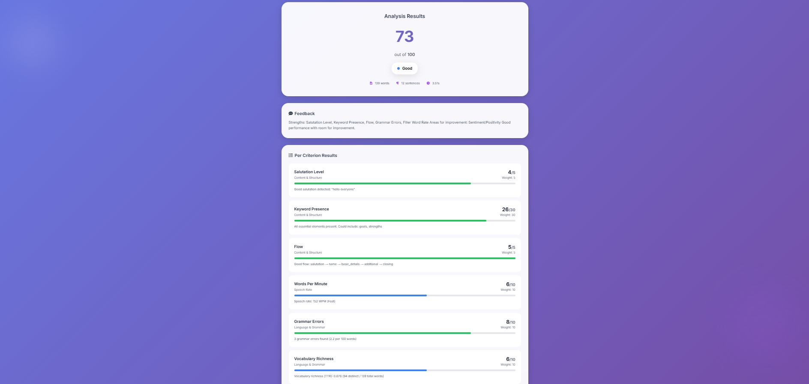

# NLP-Based Transcript Analysis System

Evaluates transcripts using multi-criteria with rule-based, NLP-based, and weighted scoring approaches.

## Features

- **8 Evaluation Criteria** (100 points total)
- **Three Analysis Approaches**: Rule-based + NLP semantic similarity + rule-driven weighting
- **Detailed Feedback**: Per-criterion scores and suggestions
- **UI**: Text input, file upload, real-time results

## Quick Start

```bash
# Install dependencies
pip install -r requirements.txt

# Run application
python app.py

# Open browser
http://localhost:5000
```

## Frontend

### Phase 1: Transcript Input Interface
The application provides a clean, intuitive interface for entering transcripts and optional duration for analysis.



### Phase 2: Analysis Results Dashboard
After analysis, users receive a comprehensive breakdown with an overall score and detailed per-criterion evaluation.



## Rubric (100 Points)

| Category | Criteria | Points |
|----------|----------|--------|
| **Content & Structure** | Salutation, Keywords, Flow | 40 |
| **Speech Rate** | Words Per Minute | 10 |
| **Language & Grammar** | Grammar Errors, Vocabulary | 20 |
| **Clarity** | Filler Word Rate | 15 |
| **Engagement** | Sentiment/Positivity | 15 |

## Usage

### Web Interface
1. Open http://localhost:5000
2. Paste transcript or upload .txt file
3. Optional: Add duration for WPM calculation
4. Click "Analyze Transcript"
5. View detailed results

### API

```bash
curl -X POST http://localhost:5000/api/analyze \
  -H "Content-Type: application/json" \
  -d '{"transcript_text": "Hello everyone...", "duration_seconds": 60}'
```


## Technologies

- **Flask** - Web framework
- **Sentence Transformers** - Semantic similarity (all-MiniLM-L6-v2)
- **LanguageTool** - Grammar checking
- **VADER** - Sentiment analysis

## Project Structure

```
Nirmaan/
├── app.py                              # Flask app
├── requirements.txt                    # Dependencies
├── Script/
│   └── rubric_transcript_analyzer.py  # Main analyzer
├── templates/
│   └── index.html                      # Web UI
├── utils/
│   ├── logger.py                       # Simple logging
│   └── exceptions.py                   # Custom exceptions
└── logs/
    └── app.log                         # Application logs
```

## Performance Levels

- **Excellent**: 85-100 points
- **Good**: 70-84 points
- **Average**: 50-69 points
- **Needs Improvement**: 0-49 points

## Notes

- First run downloads NLP models (~80MB, 2-5 minutes one-time)
- Subsequent runs are fast (1-2 seconds per analysis)
- Works with any English transcript

