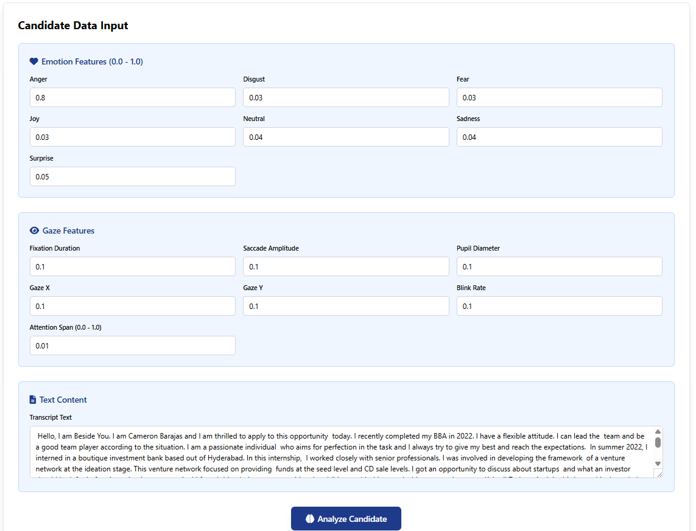
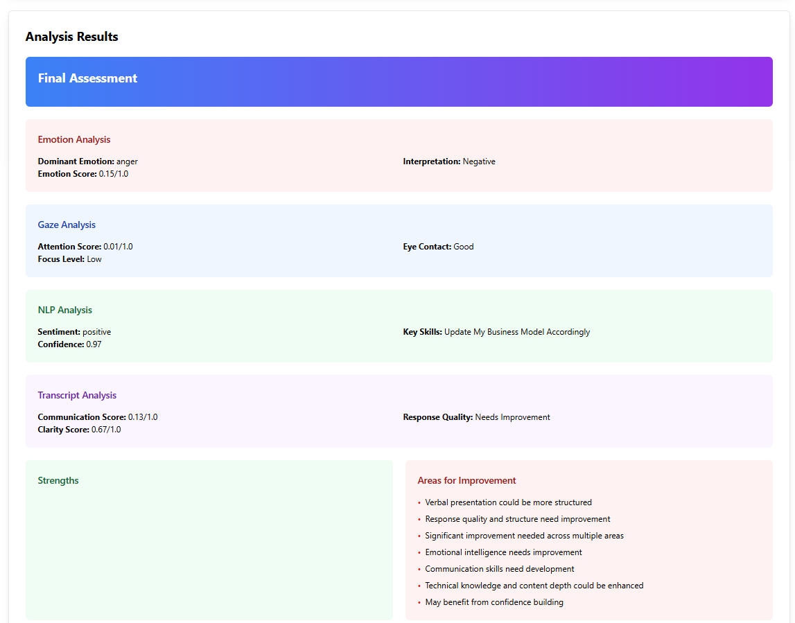

# AI Candidate Analysis System

A comprehensive web application that analyzes candidate performance using emotion data, gaze tracking, natural language processing, and transcript analysis to provide detailed candidate assessments.

## Features

### AI-Powered Analysis
- Transformer-based NLP using BERT and RoBERTa models for sentiment analysis and emotion detection
- Multi-modal assessment combining emotion, gaze, text, and transcript data
- Comprehensive scoring system with detailed strengths, weaknesses, and recommendations

### Analysis Components
- Emotion Analysis: Dominant emotions, emotional stability, and balance assessment
- Gaze Analysis: Attention patterns, focus levels, and engagement metrics
- NLP Analysis: Sentiment analysis, skills extraction, and professional profile assessment
- Transcript Analysis: Content quality, structure, and communication effectiveness

### Web Interface
- Modern HTML/CSS/JavaScript frontend with Tailwind CSS styling
- Form-based input system for individual candidate analysis
- Real-time validation and error handling
- Comprehensive results display with detailed metrics

### Candidate Assessment
- Overall scoring system with weighted composite scores
- Detailed strengths and weaknesses analysis
- Actionable recommendations for improvement
- Role suitability assessment based on performance metrics

## Project Interface

### Screenshots





## Installation

### Prerequisites
- Python 3.8 or higher
- Git
- Virtual environment (recommended)

### Setup

1. Clone the repository
```bash
git clone https://github.com/Vmaddikera/Candidate-Analysis.git
cd Candidate-Analysis
```

2. Create and activate virtual environment
```bash
python -m venv venv
# On Windows:
venv\Scripts\activate
# On macOS/Linux:
source venv/bin/activate
```

3. Install Python dependencies
```bash
pip install -r requirements.txt
```

4. Download required spaCy model
```bash
python -m spacy download en_core_web_sm
```

5. Run the application
```bash
python app.py
```

The application will be available at http://localhost:5000

## Usage

### Web Interface

1. Open your browser and navigate to http://localhost:5000
2. Fill in the form with candidate data:
   - Emotion scores (anger, disgust, fear, joy, neutral, sadness, surprise)
   - Gaze metrics (fixation duration, saccade amplitude, pupil diameter, etc.)
   - Text content (transcript and script text)
3. Click "Analyze Candidate" to run the analysis
4. View comprehensive results including scores, insights, and recommendations

### Input Format

The system accepts individual form inputs for:
- 7 emotion scores (0.0 to 1.0 range)
- 7 gaze metrics (numeric values)
- 2 text fields (transcript and script text)

### Results

The analysis provides:
- Overall candidate score (0-10 scale)
- Component-wise analysis (emotion, gaze, NLP, transcript)
- Detailed insights and recommendations
- Strengths and weaknesses identification

## API Endpoints

### POST /api/analyze
Analyzes candidate data and returns comprehensive assessment.

Request: Form data with emotion scores, gaze metrics, and text content
Response: JSON with analysis results including scores, insights, and recommendations

### GET /api/health
Health check endpoint for system status.

## Architecture

### Backend Services
- EmotionAnalyzer: Processes emotion data and calculates emotional intelligence metrics
- GazeAnalyzer: Analyzes gaze patterns and attention metrics
- NLPAnalyzer: Performs sentiment analysis, entity extraction, and skills assessment
- TranscriptAnalyzer: Evaluates content quality and communication effectiveness
- CandidateAssessor: Combines all analyses into comprehensive assessment

### Frontend
- HTML/CSS/JavaScript interface with Tailwind CSS
- Form-based input system
- Real-time validation and error handling
- Comprehensive results display

### Utilities
- DataValidator: Input validation and data cleaning
- Logger: Comprehensive logging system with file and console output
- Exceptions: Custom exception handling for different error types
- ErrorHandler: Centralized error handling and response formatting

## Models Used

### NLP Models
- Sentiment Analysis: cardiffnlp/twitter-roberta-base-sentiment-latest
- Emotion Classification: j-hartmann/emotion-english-distilroberta-base
- Named Entity Recognition: dbmdz/bert-large-cased-finetuned-conll03-english
- spaCy: en_core_web_sm for additional NLP processing

### Analysis Methods
- **Statistical Analysis**: SciPy for statistical tests and distributions
- **Pattern Matching**: Regex-based skills and competency extraction
- **Weighted Scoring**: Multi-component assessment with configurable weights
- **Fallback Systems**: Keyword-based analysis when models fail to load
- **Context-Aware Extraction**: Advanced skill detection using multiple indicators
- **Normalization**: All scores properly scaled to prevent overflow

### Skills Extraction
- **Technical Skills**: Programming languages, frameworks, databases, cloud platforms
- **Soft Skills**: Leadership, communication, teamwork, problem-solving
- **Education**: Degrees, certifications, academic background
- **Experience**: Years of experience, project types, industry background
- **Context Patterns**: "experience in X", "skills in Y", "background in Z"

## Project Structure

```
├── app.py                     # Main Flask application
├── requirements.txt           # Python dependencies
├── .gitignore                # Git ignore rules
├── services/                 # Analysis services
│   ├── emotion_analyzer.py
│   ├── gaze_analyzer.py
│   ├── nlp_analyzer.py
│   ├── transcript_analyzer.py
│   └── candidate_assessor.py
├── utils/                    # Utility functions
│   ├── data_validator.py
│   ├── logger.py
│   ├── exceptions.py
│   └── error_handler.py
├── templates/                # Frontend templates
│   └── index.html
├── emotion_data-*/           # Emotion datasets
├── transcript_data-*/        # Transcript datasets
├── transcripts-*/            # Text transcripts
└── *.ipynb                   # Analysis notebooks
```

## Configuration

### Assessment Weights
The system uses weighted scoring across components:
- Emotion Analysis: 25%
- Gaze Analysis: 25%
- NLP Analysis: 30%
- Transcript Analysis: 20%

### Scoring System
- Individual component scores: 0-1 range
- Overall score: 0-10 scale
- Normalized scoring prevents values exceeding maximum limits

## Scoring Calculations

### Overall Score Formula
```python
overall_score = (
    emotion_score * 0.25 +
    gaze_score * 0.25 +
    nlp_score * 0.30 +
    transcript_score * 0.20
) * 10
```

### Component Scoring Details

#### 1. Emotion Analysis (0-1)
- **Emotion Score**: Average of all emotion values (joy, anger, fear, etc.)
- **Positivity Score**: `(positive_emotions + neutral_emotions * 0.5) / total_emotions`
- **Balance Score**: `1 - (std_deviation / mean)` for emotional stability
- **Appropriateness**: Weighted score based on dominant emotion (joy=0.9, neutral=0.8, etc.)

#### 2. Gaze Analysis (0-1)
- **Attention Score**: Direct value from attention_span column
- **Focus Level**: High (>0.7), Medium (>0.4), Low (≤0.4)
- **Eye Contact**: Good (<1.0 blink rate), Needs Improvement (≥1.0)
- **Stability Score**: `1 / (1 + coefficient_of_variation)`

#### 3. NLP Analysis (0-1)
- **Sentiment Confidence**: RoBERTa model confidence score
- **Communication Quality**: Based on sentence length, vocabulary richness, professional language
- **Skills Count**: Technical, soft, education, and experience skills extracted
- **Professional Profile**: Career level and industry indicators

#### 4. Transcript Analysis (0-1)
- **Communication Score**: Weighted combination of quality (30%), structure (25%), coherence (20%), professional (25%)
- **Clarity Score**: `min(1.0, avg_sentence_length / 20.0)`
- **Structure Score**: Length consistency + sentence length + structure indicators
- **Quality Score**: `min(total_indicators / 10, 1.0)`

### Final Recommendation Thresholds
- **STRONG CANDIDATE**: Overall score ≥ 7.0
- **NEEDS IMPROVEMENT**: Overall score ≥ 5.0
- **NOT RECOMMENDED**: Overall score < 5.0

### Key Scoring Features
- **Normalization**: All scores capped at 1.0 to prevent overflow
- **Weighted Components**: Different importance levels for each analysis type
- **Fallback Handling**: Default values when data is missing
- **Consistency Checks**: Logic ensures insights match actual scores

### Important Technical Notes

#### Model Dependencies
- **Transformers**: Requires internet connection for initial model download
- **spaCy**: Requires `python -m spacy download en_core_web_sm`
- **Fallback Systems**: System works even if some models fail to load
- **Memory Requirements**: ~2GB RAM recommended for all models

#### Data Processing
- **Input Validation**: All numeric inputs validated and cleaned
- **Error Handling**: Graceful degradation when components fail
- **JSON Serialization**: NumPy types automatically converted
- **Logging**: Comprehensive logging for debugging and monitoring

#### Performance Considerations
- **Model Loading**: ~30-60 seconds initial startup time
- **Analysis Speed**: ~5-10 seconds per candidate analysis
- **Memory Usage**: Models loaded once and reused
- **Scalability**: Single-threaded processing (can be optimized for batch processing)

## Development

### Adding New Features
1. Create new analyzer in services/ directory
2. Update CandidateAssessor to include new component
3. Add frontend components in templates/index.html
4. Update API endpoints in app.py

### Logging
The system includes comprehensive logging:
- User actions and system status
- Analysis performance metrics
- Error tracking and debugging
- File-based logging with rotation

## Troubleshooting

### Common Issues

1. Model Loading Errors
   - Ensure all required models are downloaded
   - Check internet connection for model downloads
   - Verify Python environment and dependencies

2. Input Validation Errors
   - Check form data format and values
   - Ensure numeric values are properly formatted
   - Verify required fields are present

3. Analysis Failures
   - Check input data quality and completeness
   - Verify all required services are initialized
   - Review error logs for specific issues

4. JSON Serialization Errors
   - The system automatically handles NumPy data types
   - NaN and infinity values are converted to 0.0
   - All data is cleaned before JSON serialization

### Performance Optimization
- Use GPU acceleration for transformer models when available
- Implement caching for repeated analyses
- Optimize data processing pipelines
- Consider batch processing for multiple candidates

## Data Files

The repository includes sample datasets:
- Emotion data: CSV files with emotion scores
- Gaze data: CSV files with gaze tracking metrics
- Transcript data: Text files with interview transcripts
- Analysis notebooks: Jupyter notebooks for data exploration

## Contributing

1. Fork the repository
2. Create a feature branch
3. Make your changes
4. Add tests for new functionality
5. Submit a pull request

## License

This project is licensed under the MIT License.

## Support

For support and questions:
- Create an issue in the repository
- Check the troubleshooting section
- Review the error logs for debugging information

## Future Enhancements

- Real-time analysis dashboard
- Batch processing capabilities
- Advanced visualization components
- Machine learning model training
- Integration with HR systems
- Mobile application support